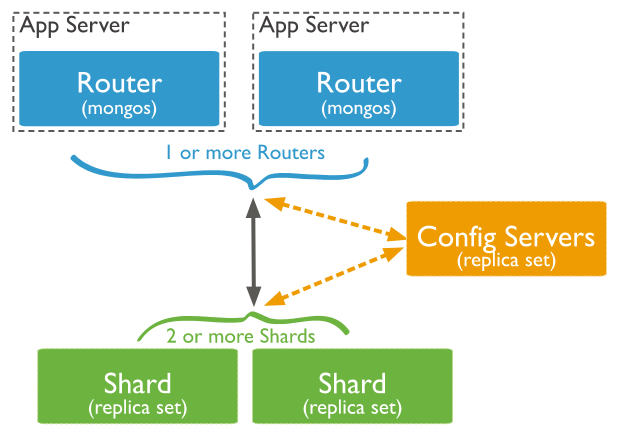

# MongoDB Cluster

MongoDB is easily scalable by adding more resources to a server (vertical scaling) or adding more servers (horizontal scaling) to a distributed system. In contrast to a single-server MongoDB database, a cluster refers to a collection of MongoDB servers working together.

You can say "*cluster*" is a meaningless word in MongoDB without the purpose. We have 2 things to note: 
* *sharding*: you split your data into many servers, commonly known as *horizontal scaling*.
* *replication*: you have many copies of the data on many servers, it ensures high availability.

"Cluster" is the word usually used for either a *replica set* or a *sharded cluster*.

You can have data centers across the globe, each is a replication of whole data for global availability. Then a data center can horizontally scale servers with sharding to hold infinite data. And then each shard cluster can be made with many replica servers of that shard of the data for sharded data availability.

## Replica Sets

### How do MongoDB replica sets work?

A replica set includes a primary node and a set of secondary nodes. At most, one primary node must exist, and it ==receives all write operations==. Clients cannot write data to secondaries. All changes on the primary node's data sets are recorded in a special capped collection called the *operation log (oplog)*. The secondary nodes then replicate the primary node's operation log and make sure that the data sets reflect exactly the primary's data sets.


If the current primary node suddenly becomes unavailable (eg. does not communicate with the other members of the set for more than a period), an election will take place to determine the new primary node. In the scenario of having two secondary nodes, one of the secondary nodes will become the primary node and normal operations will be resumed. The old primary rejoins the set when available.


The failure of a primary node is not the only reason a replica set election can occur. Replica set elections can happen for other reasons in response to a variety of events, such as when a new node is added in the replica set. In some circumstances (such as when you have a primary and a secondary, but cost constraints prohibit adding another secondary), you may choose to add an *arbiter* to your replica set. An arbiter participates in [elections for primary](https://www.mongodb.com/docs/manual/core/replica-set-elections/#std-label-replica-set-elections) but an arbiter does **not** have a copy of the data set and **cannot** become a primary.

### Read and Write operations in a Replica Set

A replica set in a MongoDB cluster is ==transparent to client applications==. This means they can’t identify whether the cluster has a replica set enabled or whether it’s running on a single server deployment.

However, MongoDB offers additional read and write operations on top of the standard input and output commands. ==By default, all read operations are directed to the primary node==, but client applications can optionally address directly to which replica set node a read operation should execute by using read preference. For example, if a client application is configured to go directly to secondaries, then the mode parameter in the read preference should be set to [secondary](https://docs.mongodb.com/manual/core/read-preference/#secondary). If there are specific needs for the least network latency, then the [nearest](https://docs.mongodb.com/manual/core/read-preference/#nearest) read preference mode should be configured. However, in this option, a risk of potentially ==stale data== comes into play (if the nearest node is a secondary node) because the replication from the primary node’s oplog to the secondaries happens ==asynchronously==.


When writing data in a MongoDB replica set, you can include additional options to ensure that the ==write has propagated successfully== throughout the cluster. This involves adding a [write concern](https://docs.mongodb.com/manual/reference/write-concern/) property. A write concern means what level of acknowledgement we desire to have from the cluster, on each write operation:

```
{w: <value>, j: <boolean>, wtimeout: <number>}
```

In the following example, if we had a 5-node replica set, we are requesting that the MongoDB cluster to acknowledge that the write has succeeded in the majority (which is 3) of the nodes, and overall, this operation should not take more than 5 seconds:

```
db.products.insert(
	{item: 'ABC', qty: 100, type: 'XYZ'},
	{writeConcern: {w: 'majority', wtimeout: 5000}}
)
```

* The **w** value can be set to **0**, meaning that no write acknowledgement is needed. **1** is the default and it means that it only requires the primary node to acknowledge the write. And, for example, **4** means the primary node and **3** secondaries need to signal.
* The **j** value corresponds to whether MongoDB has been written on disk in a special area called the [journal](https://docs.mongodb.com/manual/reference/glossary/#term-journal). This is used from MongoDB for recovery purposes in case of a hard shutdown, and it is enabled by default.
* The **wtimeout** value is the time the command should wait before returning any result. If this is not specified and if for any reason the actual write has any network issues, then the command would block indefinitely, so it is a good practice to set this value. It is measured in milliseconds and it is only applicable for **w** values greater than 1.

If the ==primary node becomes unreachable==, the replica set cannot process write operations ==until the election completes== successfully. The replica set ==can continue to serve read== queries if such queries are ==configured to [run on secondaries](https://www.mongodb.com/docs/manual/core/read-preference/#std-label-replica-set-read-preference)== while the primary is offline.

### Replica Sets Distributed Across Two or More Data Centers

While [replica sets](https://www.mongodb.com/docs/manual/reference/glossary/#std-term-replica-set) provide basic protection against single-instance failure, replica sets whose members are all located in a single data center are susceptible to data center failures. Distributing replica set members across geographically distinct data centers adds redundancy and provides fault tolerance if one of the data centers is unavailable. To protect your data in case of a data center failure, keep at least one member in an alternate data center.

For example, the following 5 member replica set distributes its members across three data centers.


## MongoDB Sharding

### Sharded Cluster Components

A MongoDB sharded cluster consists of the following components:

* [shard](https://www.mongodb.com/docs/manual/core/sharded-cluster-shards/): Each shard contains a subset of the sharded data. As of MongoDB 3.6, shards ==must be deployed as a *replica set*== to provide redundancy and high availability.
* [mongos](https://www.mongodb.com/docs/manual/core/sharded-cluster-query-router/): The `mongos` acts as a query router, providing an interface between client applications and the sharded cluster.
* [config servers](https://www.mongodb.com/docs/manual/core/sharded-cluster-config-servers/): Config servers store metadata and configuration settings for the cluster. As of MongoDB 3.4, config servers ==must be deployed as a replica set== (CSRS).

Performing queries on a single shard only returns a subset of data. Connect to the [`mongos`](https://www.mongodb.com/docs/manual/reference/program/mongos/#mongodb-binary-bin.mongos) to perform cluster level operations, including read or write operations.

Config servers store the metadata for a [sharded cluster](https://www.mongodb.com/docs/manual/reference/glossary/#std-term-sharded-cluster). The metadata reflects state and organization for all data and components within the sharded cluster. The metadata includes the list of chunks on every shard and the ranges that define the chunks. The `mongos` instances cache this data and use it to route read and write operations to the correct shards. [`mongos`](https://www.mongodb.com/docs/manual/reference/program/mongos/#mongodb-binary-bin.mongos) updates the cache when there are metadata changes for the cluster, such as [adding a shard](https://www.mongodb.com/docs/manual/tutorial/add-shards-to-shard-cluster/#std-label-sharding-procedure-add-shard). Shards also read chunk metadata from the config servers.

### Production Configuration

In a production cluster, ensure that data is redundant and that your systems are highly available. Consider the following for a production sharded cluster deployment:

- Deploy Config Servers as a 3 member [replica set](https://www.mongodb.com/docs/manual/reference/glossary/#std-term-replica-set)
- Deploy each Shard as a 3 member [replica set](https://www.mongodb.com/docs/manual/reference/glossary/#std-term-replica-set)
- Deploy one or more [`mongos`](https://www.mongodb.com/docs/manual/reference/program/mongos/#mongodb-binary-bin.mongos) routers


Deploying multiple [`mongos`](https://www.mongodb.com/docs/manual/reference/program/mongos/#mongodb-binary-bin.mongos) routers supports high availability and scalability. [`mongos`](https://www.mongodb.com/docs/manual/reference/program/mongos/#mongodb-binary-bin.mongos) provide the only interface to a sharded cluster from the perspective of applications. The most common practice is to run [`mongos`](https://www.mongodb.com/docs/manual/reference/program/mongos/#mongodb-binary-bin.mongos) instances on the same systems as your application servers, but you can maintain [`mongos`](https://www.mongodb.com/docs/manual/reference/program/mongos/#mongodb-binary-bin.mongos) instances on the shards or on other dedicated resources.



There is no limit to the number of [`mongos`](https://www.mongodb.com/docs/manual/reference/program/mongos/#mongodb-binary-bin.mongos) routers you can have in a deployment. However, as [`mongos`](https://www.mongodb.com/docs/manual/reference/program/mongos/#mongodb-binary-bin.mongos) routers communicate frequently with your config servers, monitor config server performance closely as you increase the number of routers. If you see performance degradation, it may be beneficial to cap the number of [`mongos`](https://www.mongodb.com/docs/manual/reference/program/mongos/#mongodb-binary-bin.mongos) routers in your deployment.

### Development Configuration

For testing and development, you can deploy a sharded cluster with a minimum number of components. These **non-production** clusters have the following components:

- One [`mongos`](https://www.mongodb.com/docs/manual/reference/program/mongos/#mongodb-binary-bin.mongos) instance.
- A single shard [replica set.](https://www.mongodb.com/docs/manual/reference/glossary/#std-term-replica-set)
- A replica set [config server.](https://www.mongodb.com/docs/manual/core/sharded-cluster-config-servers/#std-label-sharding-config-server)

The following diagram shows a sharded cluster architecture used for **development only**:


### Read and Write Operations on Config Servers

The `admin` database and the `config` database exist on the config servers. The `admin` database contains the collections related to the authentication and authorization. The `config` database contains the collections that contain the sharded cluster metadata. MongoDB writes data to the `config` database when the metadata changes.

### Confirm Connection to `mongos` Instances

To detect if the MongoDB instance that your client is connected to is [`mongos`](https://www.mongodb.com/docs/manual/reference/program/mongos/#mongodb-binary-bin.mongos), use the [`hello`](https://www.mongodb.com/docs/manual/reference/command/hello/#mongodb-dbcommand-dbcmd.hello) command. When a client connects to a [`mongos`](https://www.mongodb.com/docs/manual/reference/program/mongos/#mongodb-binary-bin.mongos), [`hello`](https://www.mongodb.com/docs/manual/reference/command/hello/#mongodb-dbcommand-dbcmd.hello) returns a document with a `msg` field that holds the string `isdbgrid`. For example:

```json
{
   "isWritablePrimary" : true,
   "msg" : "isdbgrid",
   "maxBsonObjectSize" : 16777216,
   "ok" : 1,
   ...
}
```

If the application is instead connected to a [`mongod`](https://www.mongodb.com/docs/manual/reference/program/mongod/#mongodb-binary-bin.mongod), the returned document does not include the `isdbgrid` string.

### Targeted Operations vs. Broadcast Operations

Generally, the fastest queries in a sharded environment are those that [`mongos`](https://www.mongodb.com/docs/manual/reference/program/mongos/#mongodb-binary-bin.mongos) route to a single shard, using the *shard key* and the cluster meta data from the [config server](https://www.mongodb.com/docs/manual/core/sharded-cluster-config-servers/#std-label-sharding-config-server). These [targeted operations](https://www.mongodb.com/docs/manual/core/sharded-cluster-query-router/#std-label-sharding-mongos-targeted) use the shard key value to locate the shard or subset of shards that satisfy the query document.

For queries that don't include the shard key, [`mongos`](https://www.mongodb.com/docs/manual/reference/program/mongos/#mongodb-binary-bin.mongos) must query all shards, wait for their responses and then return the result to the application. These "scatter/gather" queries can be ==long== running operations.


https://www.mongodb.com/basics/clusters
https://www.mongodb.com/docs/manual/replication/
https://learn.mongodb.com/courses/m103-basic-cluster-administration

## Further readings

* [MongoDB Cluster](https://www.mongodb.com/basics/clusters)
* [MongoDB Replication](https://www.mongodb.com/docs/manual/replication/)
* [MongoDB Sharding](https://www.mongodb.com/docs/manual/sharding/)